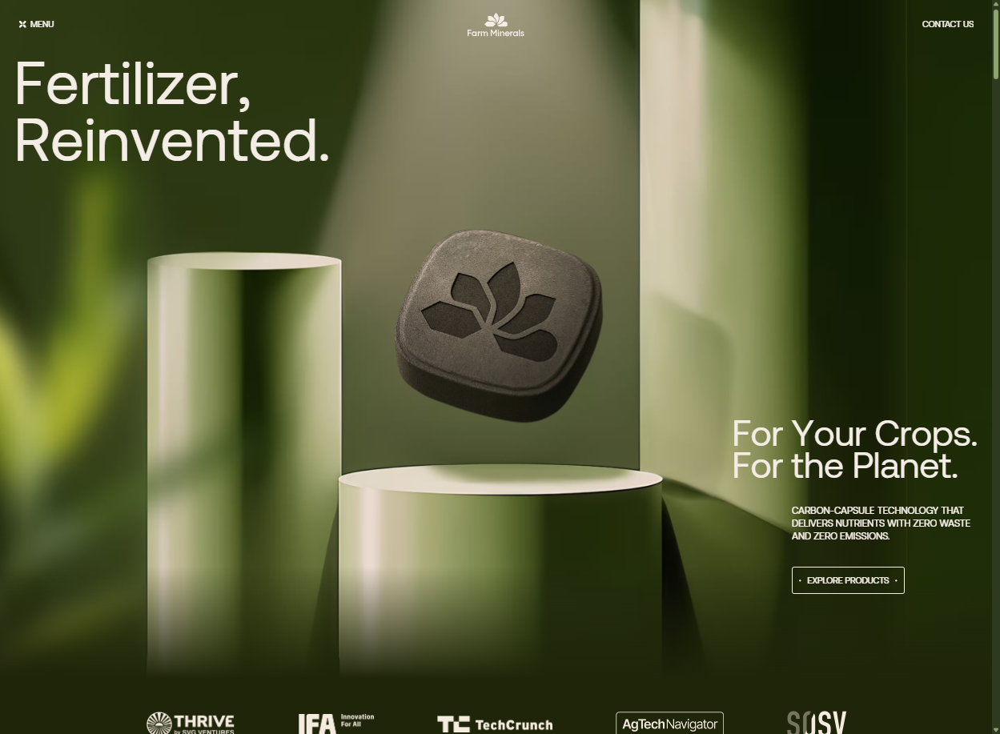
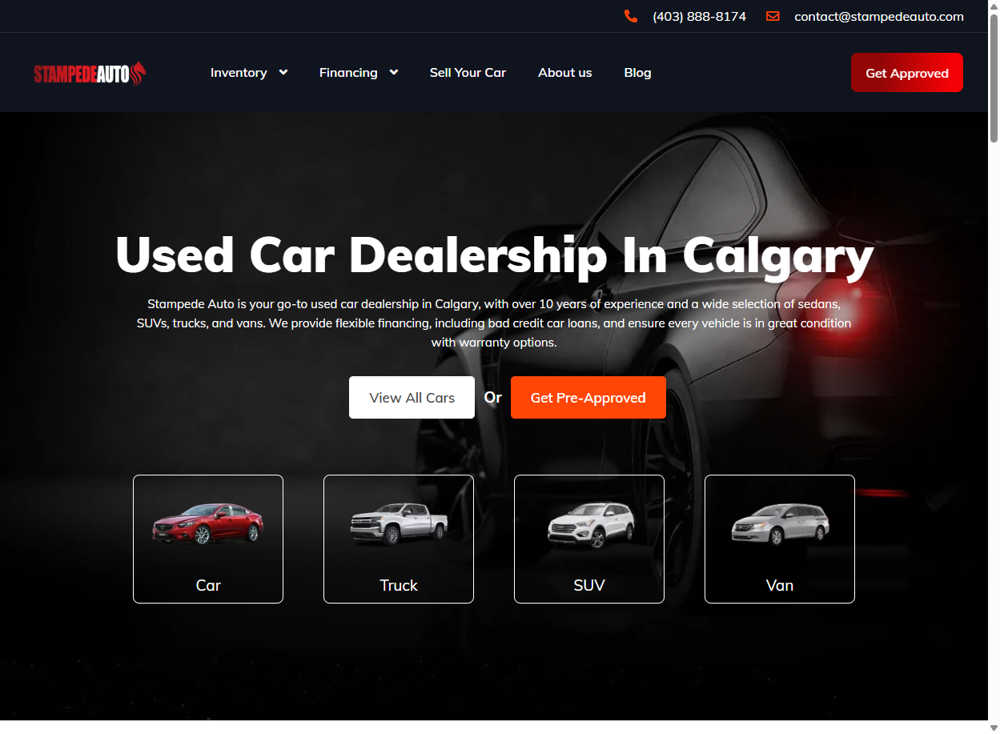
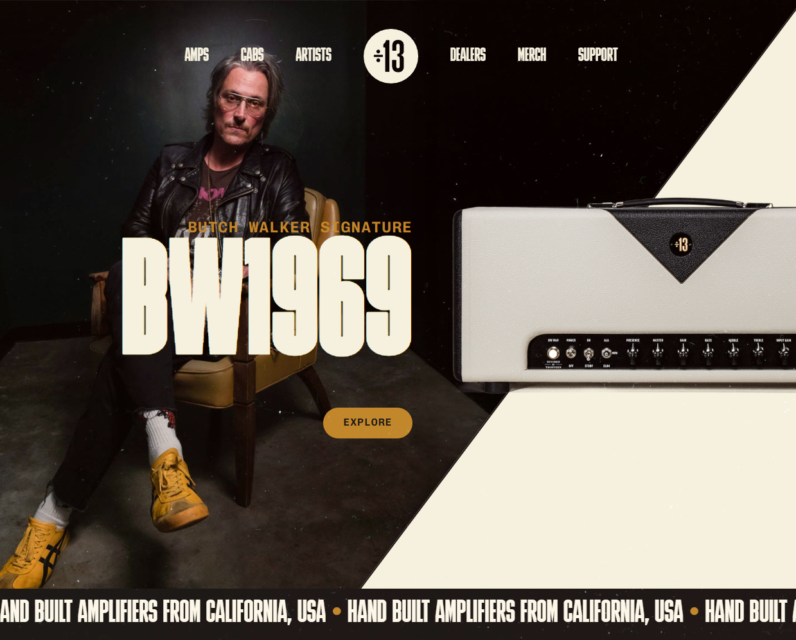

# WebCraft Model Library

> Biblioteca de modelos de desenvolvimento baseados em disseccoes de sites reais.
> Cada modelo inclui blueprint completo, design tokens, e screenshots de referencia.

**Squad:** WebCraft Squad
**Criado:** 2026-03-17

---

## Como Usar

1. **Escolha um modelo** pela categoria, tags, ou visual
2. **Leia o README.md** do modelo para overview e scores
3. **Use o dev-model.md** como blueprint de implementacao
4. **Importe os tokens.json** para seu design system
5. **Consulte os screenshots/** como referencia visual

## Como Adicionar Novos Modelos

1. Ativar WebCraft Squad: `/AIOX:squads:webcraft-squad`
2. Executar disseccao: `*dissect {url}`
3. Solicitar criacao do modelo de desenvolvimento
4. Template disponivel em `_templates/new-model-template.md`

---

## Catalogo de Modelos

### 001 — Farm Minerals

| | |
|---|---|
| **Tipo** | Corporate Product Site |
| **Industria** | AgTech / CleanTech |
| **URL** | https://www.farmminerals.com/ |
| **Score Global** | 6.4/10 (8.0 design, 3.5 a11y) |
| **Stack** | Webflow + GSAP + Lenis + Splide.js |
| **Destaque** | Scroll storytelling, editorial typography, rich Schema.org |
| **Tags** | `corporate` `product` `agtech` `storytelling` `scroll-animation` `premium` |
| **Pasta** | [`farmminerals/`](farmminerals/) |

---

### 002 — Stampede Auto

| | |
|---|---|
| **Tipo** | Local Business / Auto Dealership |
| **Industria** | Automotive |
| **URL** | https://stampedeauto.com/ |
| **Score Global** | 4.3/10 (5.5 GEO, 3.0 SEO — noindex!) |
| **Stack** | WordPress + Elementor + Vehica Theme |
| **Destaque** | AutoDealer schema, Google Reviews, vehicle categories, financing CTA |
| **Tags** | `local-business` `auto-dealer` `wordpress` `elementor` `automotive` `seo-local` `dark-theme` |
| **Pasta** | [`stampedeauto/`](stampedeauto/) |

---

### 003 — Lupine Lights

| | |
|---|---|
| **Tipo** | E-commerce / DTC Brand |
| **Industria** | Outdoor / Cycling / Lighting |
| **URL** | https://www.lupinelights.com/ |
| **Score Global** | 6.3/10 (8.5 design, 5.0 GEO) |
| **Stack** | Shopify (custom theme) |
| **Destaque** | Cinematic dark design, product spec cards, activity-based nav, multi-language |
| **Tags** | `e-commerce` `dtc` `shopify` `outdoor` `cycling` `dark-theme` `premium` `german-engineering` |
| **Pasta** | [`lupinelights/`](lupinelights/) |

---

### 004 — Divided by 13

| | |
|---|---|
| **Tipo** | Craft Luxury Brand / Boutique Manufacturer |
| **Industria** | Music / Guitar Amplifiers |
| **URL** | https://dividedby13.com/ |
| **Score Global** | 6.5/10 (8.3 design, 5.0 GEO) |
| **Stack** | WordPress (custom theme) |
| **Destaque** | Split nav, marquee ticker, product spec cards, monumental footer, authentic photography |
| **Tags** | `craft-luxury` `boutique` `manufacturer` `wordpress` `dark-theme` `split-nav` `marquee` `product-specs` `instagram-feed` `monumental-footer` `premium` `music` |
| **Pasta** | [`dividedby13/`](dividedby13/) |

---

### 005 — GMX Digital

| | |
|---|---|
| **Tipo** | Digital Agency / One-Page Landing |
| **Industria** | Web Design, Branding & IA |
| **URL** | https://gmxdigital.com/ |
| **Score Global** | 6.6/10 (9.0 design, 4.0 GEO) |
| **Stack** | HTML/CSS/JS + THREE.js (custom, sem CMS) |
| **Destaque** | 3D WebGL hero, gradient typography, glassmorphism cards, drag portfolio, application form, Awwwards nominee |
| **Tags** | `agency` `one-page` `landing` `webgl` `threejs` `3d` `dark-theme` `glassmorphism` `gradient` `marquee` `showreel` `portfolio` `form` `premium` `awwwards` |
| **Pasta** | [`gmxdigital/`](gmxdigital/) |

---

### 006 — AIOX Brand

| | |
|---|---|
| **Tipo** | Design System / Brandbook / Brand Identity Portal |
| **Industria** | AI/Tech — Framework de Orquestracao de Agentes |
| **URL** | https://brand.aioxsquad.ai/ |
| **Score Global** | 8.1/10 (10 tokens, 9.5 estrutura, 9.0 design) |
| **Stack** | Next.js (App Router) + Tailwind CSS + Radix UI + shadcn/ui |
| **Destaque** | 70+ design tokens OKLCH, dual-theme (Lime+Gold), 44+ paginas, Dark Cockpit philosophy, HUD numeracao, 60+ componentes, surface stack 7 niveis, opacity ladder 14 steps |
| **Tags** | `design-system` `brandbook` `dark-mode` `oklch` `nextjs` `tailwind` `shadcn` `radix-ui` `dual-theme` `dark-cockpit` `hud-design` `token-architecture` `component-library` |
| **Pasta** | [`aioxbrand/`](aioxbrand/) |

---

<!-- NEXT MODEL: copie o bloco acima e incremente o numero -->

## Estatisticas

| Metrica | Valor |
|---------|-------|
| Total de modelos | 6 |
| Ultima atualizacao | 2026-03-17 |
| Categorias cobertas | Corporate/Product, Local Business, E-commerce/DTC, Craft Luxury/Manufacturer, Agency/Landing, Design System/Brandbook |
| Industrias cobertas | AgTech/CleanTech, Automotive, Outdoor/Cycling, Music/Amplifiers, Web Design/Branding, AI/Tech |

## Categorias Planejadas

- [ ] SaaS / Dashboard Landing
- [x] E-commerce / DTC
- [x] Portfolio / Agency
- [ ] Media / Blog / Publication
- [ ] Marketplace / Platform
- [ ] Non-profit / Institutional
- [ ] App Landing / Mobile-First
- [x] Local Business / Auto Dealer
- [x] Corporate / Product
- [x] Craft Luxury / Boutique Manufacturer
- [x] Design System / Brandbook
