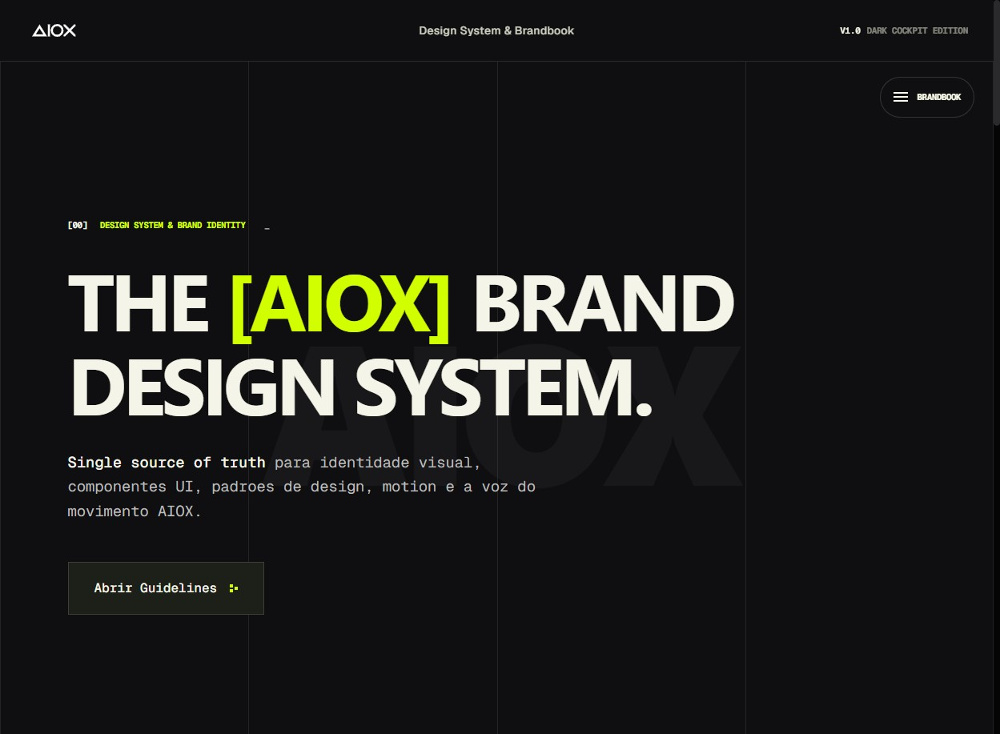
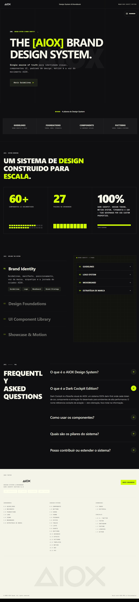

# AIOX Brand — Development Model Card

> Design System & Brandbook Portal | AI/Tech

**URL:** https://brand.aioxsquad.ai/
**Plataforma:** Next.js (App Router) + Tailwind CSS + Radix UI + shadcn/ui
**Data de Analise:** 2026-03-17
**Edicao:** Dark Cockpit Edition V2.0 — Lime + Gold Themes

---

## Preview

### Desktop — Homepage Hero

### Desktop — Homepage Full

---

## Scores (Disseccao WebCraft Squad)

| Dimensao | Score |
|----------|-------|
| Estrutura & Padroes | 9.5/10 |
| Design Visual & Criativo | 9.0/10 |
| Animacao & Motion | 7.5/10 |
| Design Tokens | 10/10 |
| Performance | 8.0/10 |
| Acessibilidade | 7.5/10 |
| SEO | 6.0/10 |
| GEO / AI Search | 7.5/10 |
| **Global** | **8.1/10** |

## Pontos Fortes

- **Sistema de tokens magistral:** 70+ CSS custom properties com OKLCH color space, 14-step opacity ladder, 7-level surface stack, shadcn/ui mapping table — o mais completo da biblioteca
- **Dual-theme architecture:** Lime (neon) + Gold (champagne) compartilham surface stack, so variam accent — elegancia arquitetural
- **Dark Cockpit philosophy:** Nao e "dark mode" generico — e uma filosofia de design coesa inspirada em cockpits de aviacao com HUD numeracao `[NN]`, mono labels, e surface hierarchy funcional
- **44+ paginas de documentacao:** Cada componente, token, pattern e fundacao tem sua propria pagina dedicada
- **Tipografia tripartida:** Display (TASAOrbiter) + Sans (Geist) + Mono (RobotoMono) com papeis claros e type scale de 7 niveis
- **Component library completa:** 60+ componentes com demos interativos, status badges, e variantes documentadas
- **Numeracao HUD consistente:** `[00]` to `[NN]` em todas as secoes cria wayfinding tecnico unico

## Pontos a Melhorar

- **SEO:** Pagina `/seo` documenta meta tags e JSON-LD, mas a implementacao no site e incompleta
- **Skip to content:** Link de acessibilidade nao observado
- **prefers-reduced-motion:** Verificar se respeita preferencia do usuario
- **Auto-navigation SPA:** O site tem modo demo que auto-navega entre paginas, pode confundir usuarios

## Arquivos do Modelo

| Arquivo | Descricao |
|---------|-----------|
| `dev-model.md` | Blueprint completo com 13 secoes (985 linhas) — arquitetura, tokens, componentes, blueprints, LP architecture |
| `tokens.json` | Design tokens DTCG — cores (Lime+Gold), tipografia, spacing, motion, elevation |
| `screenshots/` | Screenshots de todas as paginas (44+ screenshots) |

## Ideal Para

- Design Systems documentados com dark-first approach
- Brandbooks digitais interativos com theme switching
- SaaS dashboards com interface densa (cockpit-style)
- Developer portals com documentacao tecnica numerada
- Qualquer projeto que precisa de dual-theme architecture

## Tags

`design-system` `brandbook` `dark-mode` `oklch` `nextjs` `tailwind` `shadcn` `radix-ui` `dual-theme` `dark-cockpit` `hud-design` `token-architecture` `geist` `component-library` `44-pages`
