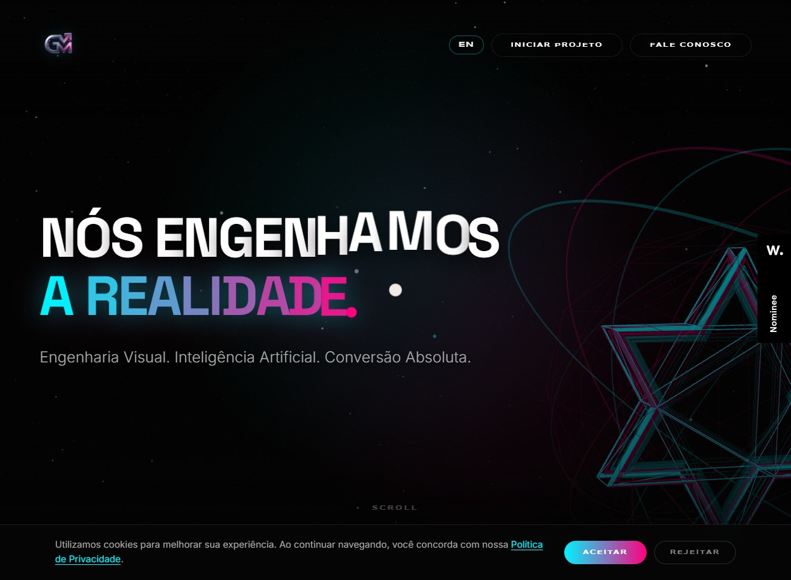
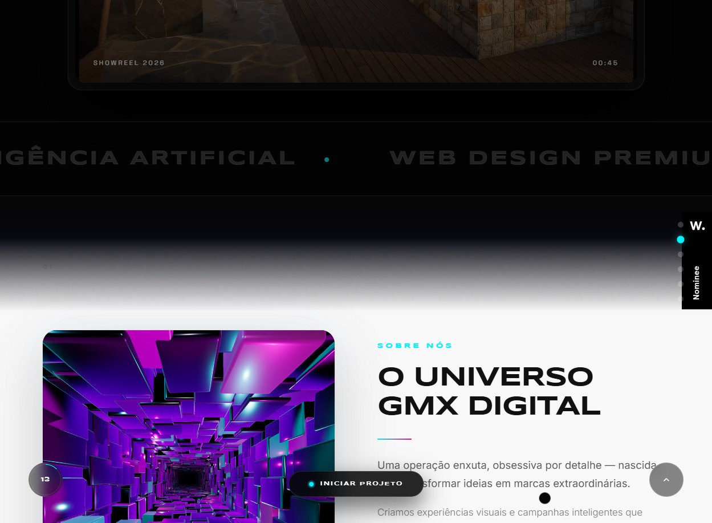
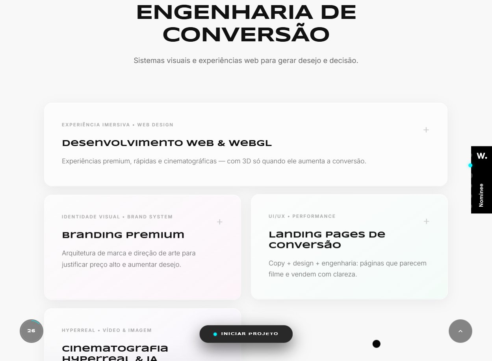
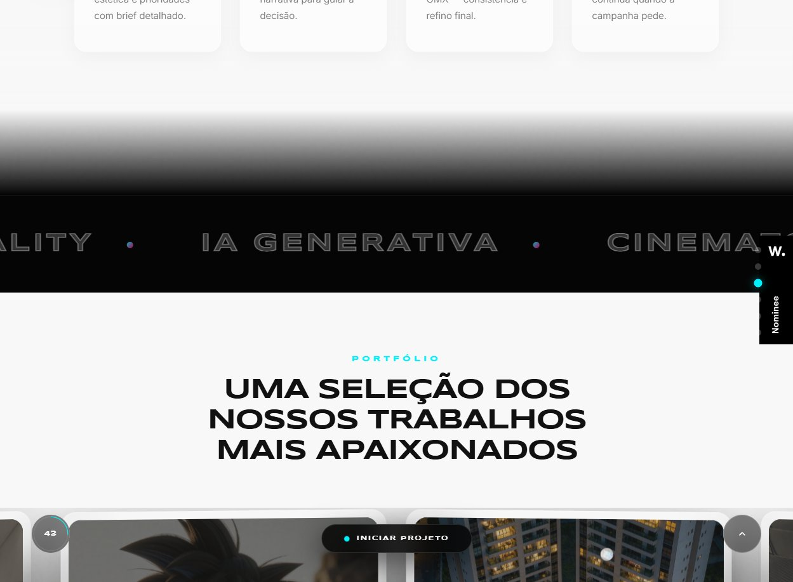
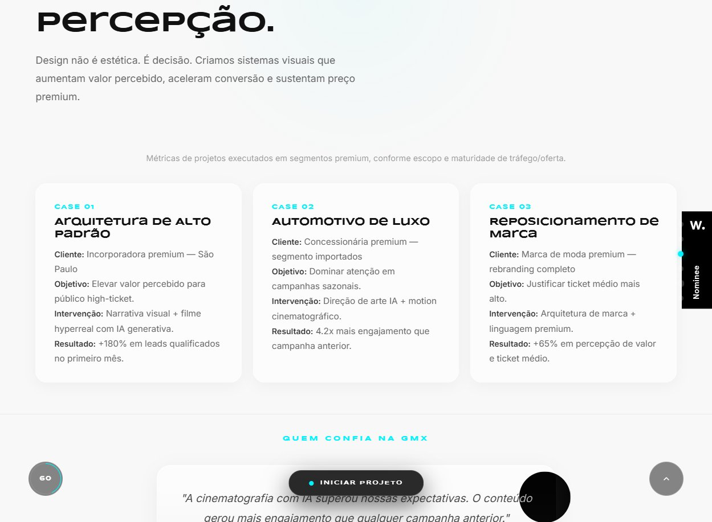
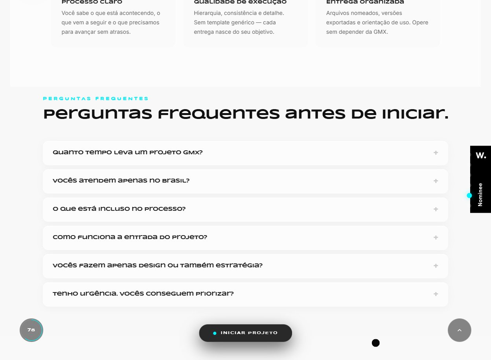
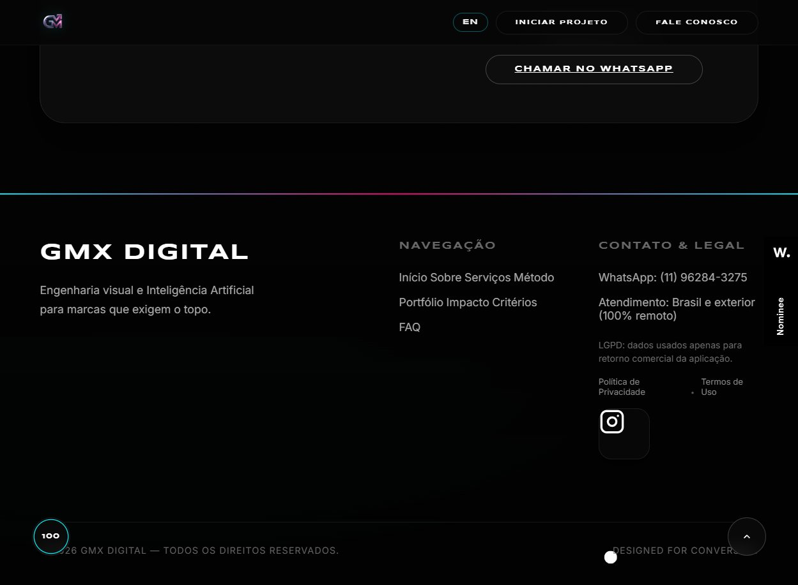

# GMX Digital — Development Model Card

> Digital Agency / One-Page Landing | Web Design Premium, Branding & IA

**URL:** https://gmxdigital.com/
**Plataforma:** HTML/CSS/JS estático (custom build, sem CMS)
**Data de Analise:** 2026-03-17

---

## Preview

### Desktop — Hero (3D WebGL + Gradient Typography)

### Desktop — Showreel + Marquee

### Desktop — Services (Glassmorphism Cards)

### Desktop — Method + Portfolio Transition

### Desktop — Impact Stats + Case Studies

### Desktop — FAQ Section

### Desktop — Application Form (Dark)

### Desktop — Footer

---

## Scores (Disseccao WebCraft Squad)

| Dimensao | Score |
|----------|-------|
| Estrutura & Padroes | 8.5/10 |
| Design Visual & Criativo | 9.0/10 |
| Animacao & Motion | 9.0/10 |
| Design Tokens | 7.5/10 |
| Performance | 5.5/10 |
| Acessibilidade | 5.0/10 |
| SEO | 4.5/10 |
| GEO / AI Search | 4.0/10 |
| **Global** | **6.6/10** |

## Tech Stack

| Componente | Tecnologia |
|-----------|-----------|
| Frontend | HTML5 + CSS3 + Vanilla JS (custom) |
| 3D Engine | THREE.js (tunel-gmx.js — GLB model, 3500 blocos, environment map) |
| Video | HTML5 video (showreel.mp4) |
| Audio | Hover sound effects (hover.mp3) |
| Portfolio | Custom drag carousel com auto-scroll e clones |
| Forms | Custom validation + success/error states |
| Cookie | Custom consent dialog (LGPD) |
| i18n | PT/EN via paginas separadas (en/index.html) |
| Badge | Awwwards Nominee |
| Hosting | Estatico (sem CMS) |

## Pontos Fortes

- **Hero 3D imersivo** — universo de estrelas WebGL com THREE.js + tipografia com gradiente multicolor (branco → cyan → magenta)
- **Marquee duplo** — dois marquee tickers em posicoes diferentes (pos-hero e pos-portfolio) com conteudo tematico diferente
- **Loading screen cinematico** — "ENGENHARIA DA REALIDADE" + barra de progresso 0-100%
- **Showreel embed** — video em frame com glass effect, metadata "SHOWREEL 2026 / 00:45" + botao PLAY estilizado
- **Service cards glassmorphism** — cards com fundo glass translucido, tag de categoria + titulo + descricao expandivel
- **Metodo em timeline** — 4 steps numerados (01-04) em grid horizontal, clean e efetivo
- **Portfolio drag carousel** — cards com imagem + overlay info + "ASSISTIR VIDEO", drag horizontal + auto-scroll + loop infinito
- **Stats com impacto** — "+280%", "4x", "+65%" em tipografia bold com case studies detalhados abaixo
- **Testimonials em carousel** — blockquotes em cards dark com atribuicao anonimizada por segmento
- **Criteria section** — tags de segmentos atendidos + 3 cards info (Perfil Ideal, Escopo, Operacao) + 3 checkmarks
- **FAQ accordion** — items em cards com borda glass, expand/collapse
- **Application form robusto** — 2-col layout com 8 campos, selects customizados, CTA gradient (cyan → magenta), WhatsApp fallback
- **Section nav dots** — navegacao lateral por secoes (INICIO, SOBRE, SERVICOS, PORTFOLIO, IMPACTO, APLICACAO)
- **Scroll progress** — indicador numerico de progresso no canto inferior esquerdo
- **Floating CTA** — "INICIAR PROJETO" sticky no bottom center
- **Awwwards badge** — Nominee badge fixo no canto direito
- **Hover sound FX** — audio feedback em interacoes (premium feel)

## Pontos a Melhorar (corrigidos no dev-model)

- **Performance pesada** — THREE.js + GLB + 3500 blocos + video + audio = LCP alto
- **Sem Schema markup** — Organization, LocalBusiness, FAQPage ausentes
- **One-page limita SEO** — todo conteudo em uma pagina, sem URL structure para crawlers
- **Forms sem labels HTML** — inputs usam placeholders flutuantes mas sem `<label>` semantico
- **Marquee sem prefers-reduced-motion** — animacoes podem causar desconforto
- **Alt text generico em portfolio** — imagens tem alt mas descricoes podem ser mais especificas
- **Showreel video nao carrega** — ERR_CACHE_FAILURE no mp4 (problema de hosting)
- **H2 repetidos no portfolio** — cada portfolio item usa H2, quebrando hierarquia
- **Contraste cyan sobre preto** — pode falhar AA em texto pequeno
- **JS errors** — click-fix.js e tunel-gmx.js produzem erros em console

## Arquivos do Modelo

| Arquivo | Descricao |
|---------|-----------|
| `README.md` | Este card de referencia |
| `dev-model.md` | Blueprint completo de desenvolvimento |
| `tokens.json` | Design tokens exportaveis (primitivos + semanticos + componentes) |
| `screenshots/` | 8 screenshots de referencia |

## DNA do Design — "Hyperreal Agency Landing"

Este modelo captura a essencia de uma **agencia digital premium one-page**:

1. **Hero 3D imersivo** com WebGL e tipografia gradiente
2. **Loading screen cinematico** com barra de progresso
3. **Marquee tickers tematicos** em multiplas posicoes
4. **Showreel embed** com glass frame
5. **Service cards** com glassmorphism
6. **Timeline de metodo** numerada
7. **Portfolio drag carousel** com loop infinito
8. **Stats de impacto** + case studies
9. **Application form** como CTA principal (nao e-commerce)
10. **Section nav dots** + scroll progress indicator
11. **Floating sticky CTA** + WhatsApp fallback
12. **Gradiente cyan-magenta** como accent system

## Ideal Para

- Agencias digitais premium e estudios criativos
- Landing pages de servico high-ticket / consultoria
- Portfolios de video/cinematografia/IA generativa
- Marcas que querem causar impacto visual no primeiro acesso
- Sites one-page com formulario de aplicacao (nao e-commerce)
- Prestadores de servico B2B premium

## Tags

`agency` `one-page` `landing` `webgl` `threejs` `3d` `dark-theme` `glassmorphism` `gradient` `cyan-magenta` `marquee` `showreel` `portfolio` `drag-carousel` `form` `high-ticket` `premium` `awwwards` `hyperreal` `cinematography`
