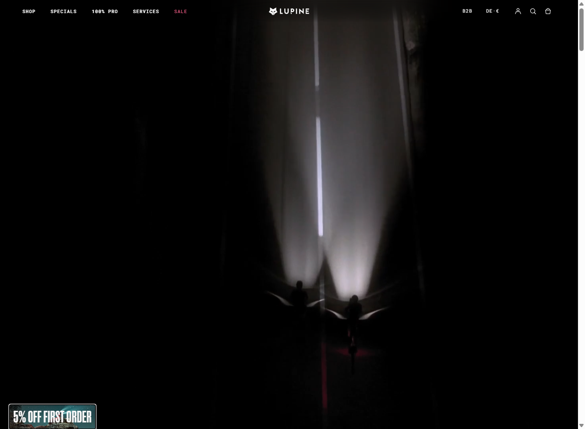
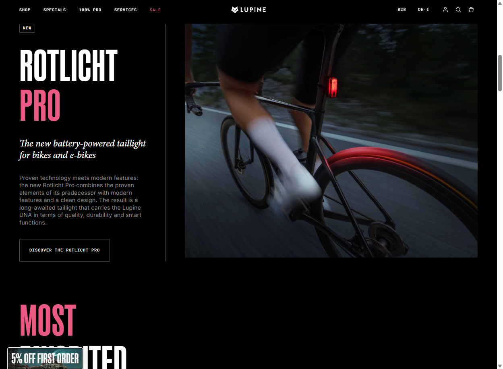
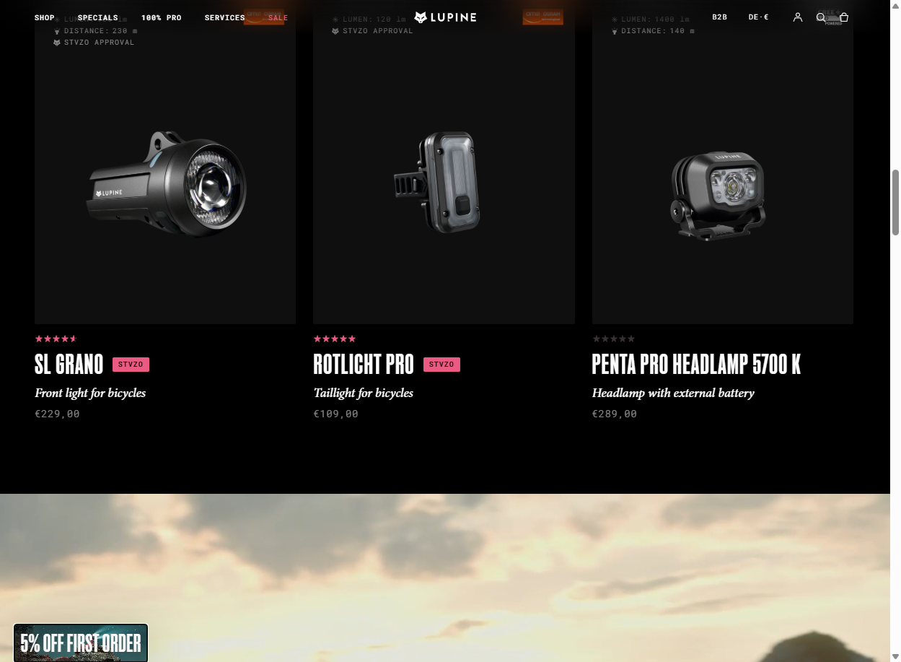
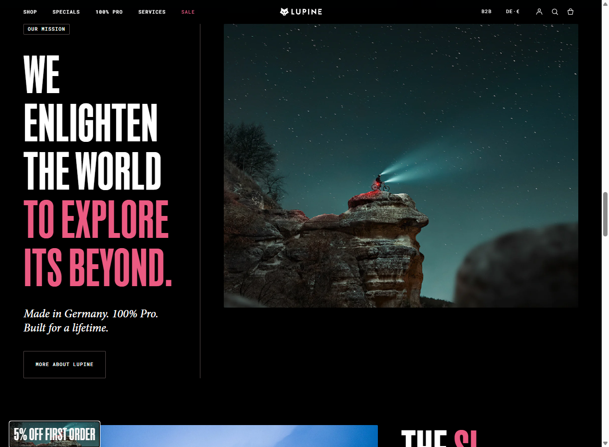
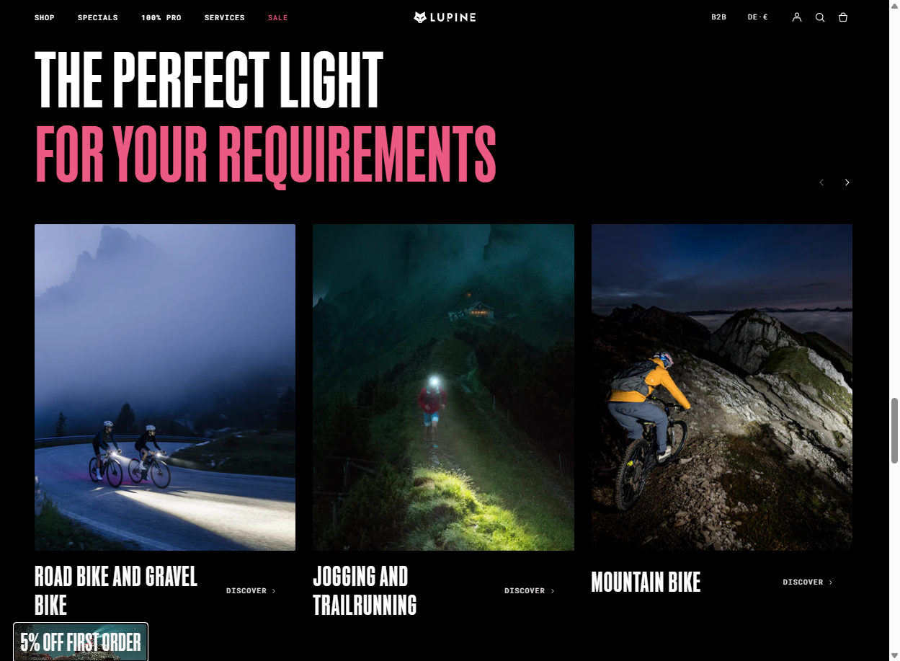
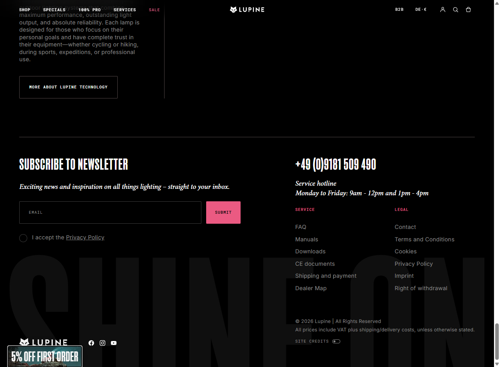
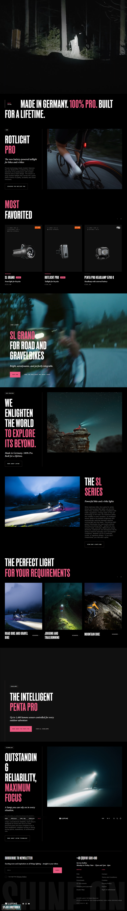

# Lupine Lights — Development Model Card

> E-commerce / DTC Brand | Outdoor / Cycling / Lighting

**URL:** https://www.lupinelights.com/
**Plataforma:** Shopify (custom theme)
**Data de Analise:** 2026-03-17

---

## Preview

### Desktop — Hero (video/cinematic dark)

### Desktop — New Product Launch

### Desktop — Product Grid (Most Favorited)

### Desktop — Mission Statement

### Desktop — Activity Categories

### Desktop — Footer (Newsletter + Service)

### Full Page — Homepage

---

## Scores (Disseccao WebCraft Squad)

| Dimensao | Score |
|----------|-------|
| Estrutura & Padroes | 7.5/10 |
| Design Visual & Criativo | 8.5/10 |
| Animacao & Motion | 7.0/10 |
| Design Tokens | 5.0/10 |
| Performance | 6.0/10 |
| Acessibilidade | 5.0/10 |
| SEO | 6.5/10 |
| GEO / AI Search | 5.0/10 |
| **Global** | **6.3/10** |

## Tech Stack

| Componente | Tecnologia |
|-----------|-----------|
| E-commerce | Shopify |
| Theme | Custom (nao identificado como theme publico) |
| CDN | Shopify CDN |
| i18n | Shopify Markets (DE/EN com hreflang) |
| Newsletter | Integrado (Shopify + Klaviyo provavel) |
| Reviews | Rating stars inline nos product cards |
| Search | Shopify native com search box |
| Cart | Slide-out cart sidebar |
| Popup | Email capture popup (5% off first order) |

## Pontos Fortes

- **Design cinematico dark** — fundo preto com fotografia de alta qualidade (luzes na escuridao = produto demonstrado no contexto perfeito)
- **Product cards com "Shine on Chart"** — cada produto mostra lumen, distancia e certificacao (StVZO) visualmente — excelente UX de comparacao
- **Tipografia forte** — mono/condensed uppercased nos headings, italico para emphasis, cria identidade de marca "pro/tecnica"
- **Hreflang correto** (x-default, de, en) — multi-mercado bem implementado
- **Landmarks semanticos presentes** — header(1), nav(9), main(1), footer(1) com `<contentinfo>`
- **Navigation structure** — Shop, Specials, 100% PRO, Services, Sale + B2B link + country/currency selector
- **Activity-based categories** — Road bike, Trail running, MTB, Winter sports, Hiking — organizado por uso, nao por produto
- **Mission statement forte** — "WE ENLIGHTEN THE WORLD TO EXPLORE ITS BEYOND" + "Made in Germany. 100% Pro. Built for a lifetime."
- **B2B section** — Link direto para request form B2B no header
- **Newsletter com incentivo** — 5% off first order popup + footer subscribe
- **GDPR compliance** — Privacy Policy checkbox no newsletter

## Pontos a Melhorar (corrigidos no dev-model)

- **19/87 imagens sem alt text** (22%) — precisa corrigir
- **Sem skip link**
- **2 form inputs sem labels** (search box e newsletter email)
- **JSON-LD quebrado** (parse retorna null) — Schema.org nao funcional
- **Sem H1 na homepage** — hero nao tem heading principal, primeiro heading visivel e H3
- **Heading hierarchy irregular** — pula de H2 para H4 em secoes, H3 repetidos
- **Popup intrusivo** — captura email bloqueando a experiencia antes de ver conteudo
- **Hero sem CTA ou texto** — apenas video/imagem escura sem call-to-action visivel
- **Product card ratings: "null estrelas"** — bug: produtos sem reviews mostram "null" ao inves de esconder
- **87 imagens na homepage** — potencial impacto na performance
- **Canonical OK mas OG image usa protocol-relative URL** (`//www.lupine...`) — pode causar issues em alguns crawlers

## Arquivos do Modelo

| Arquivo | Descricao |
|---------|-----------|
| `README.md` | Este card de referencia |
| `screenshots/` | 7 screenshots de referencia |

## Ideal Para

- E-commerce DTC de produtos premium/tecnico
- Marcas de outdoor, esporte, equipamento tecnico
- Sites que precisam demonstrar produto no contexto de uso
- Lojas Shopify com catalogo de produtos de nicho
- Marcas B2B + B2C simultaneas
- Sites multi-idioma (DE/EN)

## Tags

`e-commerce` `dtc` `shopify` `outdoor` `cycling` `lighting` `dark-theme` `premium` `german-engineering` `b2b` `multi-language` `product-cards` `cinematic`
