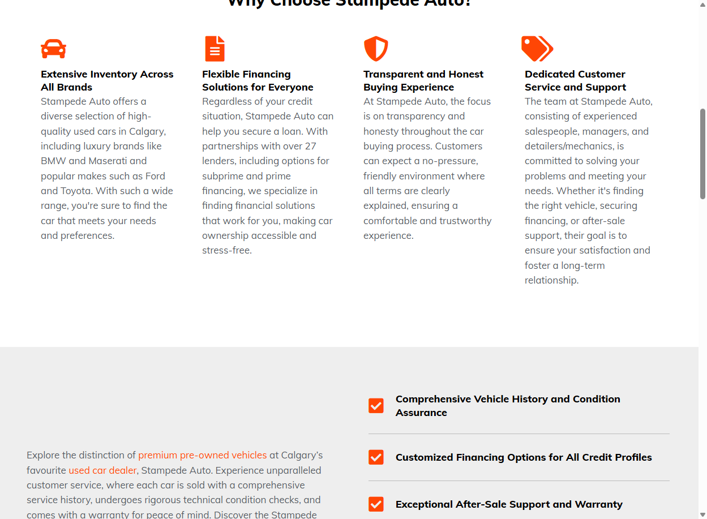
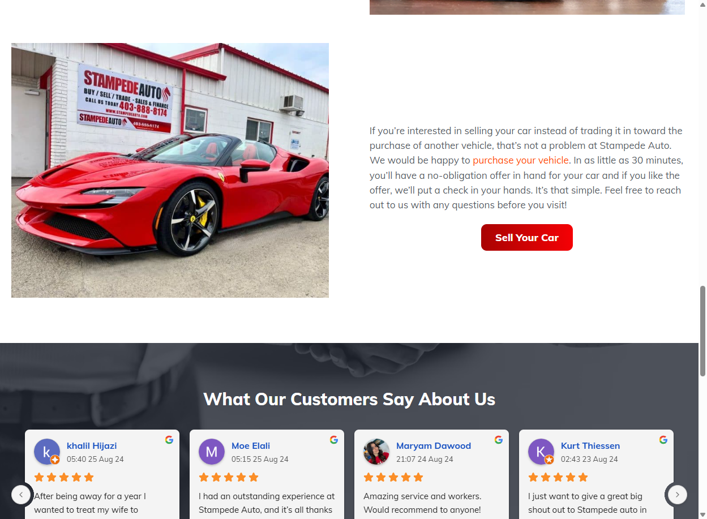
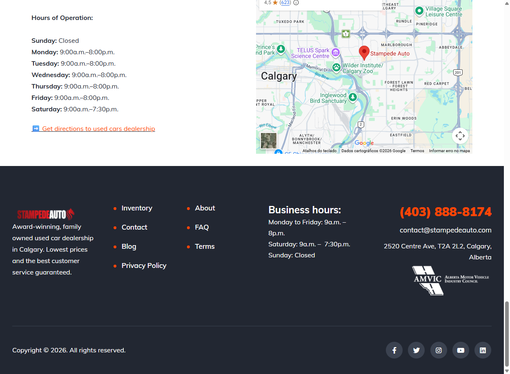
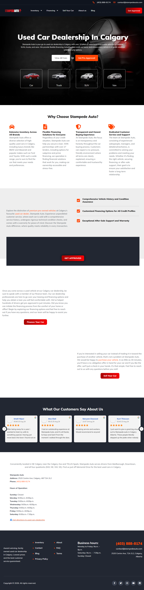

# Stampede Auto — Development Model Card

> Local Business / Auto Dealership | Automotive

**URL:** https://stampedeauto.com/
**Plataforma:** WordPress + Elementor + Vehica Theme
**Data de Analise:** 2026-03-17

---

## Preview

### Desktop — Hero

### Desktop — Why Choose / Features

### Desktop — Sell Your Car + Testimonials

### Desktop — Map + Footer

### Full Page — Homepage

---

## Scores (Disseccao WebCraft Squad)

| Dimensao | Score |
|----------|-------|
| Estrutura & Padroes | 5.5/10 |
| Design Visual & Criativo | 4.0/10 |
| Animacao & Motion | 3.0/10 |
| Design Tokens | 3.0/10 |
| Performance | 6.0/10 |
| Acessibilidade | 4.5/10 |
| SEO | 3.0/10 |
| GEO / AI Search | 5.5/10 |
| **Global** | **4.3/10** |

## Tech Stack

| Componente | Tecnologia |
|-----------|-----------|
| CMS | WordPress 6.9.4 |
| Builder | Elementor 3.35.7 |
| Theme | Vehica (auto dealer) v1.0.40 |
| Cache | WP Rocket 3.20.6.1 |
| CDN | Cloudflare |
| Lazy Load | lazysizes + WP Rocket lazyload |
| Analytics | Cloudflare Web Analytics |
| Images | WebP |

## Pontos Fortes

- Schema.org AutoDealer completo (name, address, geo, hours, sameAs, areaServed, knowsAbout)
- 100% das imagens com alt text (17/17)
- 5 canais sociais (Facebook, Twitter, Instagram, YouTube, LinkedIn)
- Google Reviews integrados com carousel
- Google Maps embed com endereco
- CTA forte e repetido ("Get Approved", "Get Pre-Approved")
- Vehicle category cards no hero (Car, Truck, SUV, Van)
- AMVIC badge de credibilidade no footer
- Horarios de funcionamento inline + Schema

## Pontos a Melhorar (corrigidos no dev-model)

- **CRITICO: `robots: follow, noindex`** — homepage bloqueada para indexacao!
- Sem `<nav>`, `<main>`, `<footer>` semanticos (tudo `
`)
- Sem skip link
- Design generico de template Elementor — sem personalidade visual
- Tipografia sem hierarquia clara (mix de serif italico + sans bold)
- Paleta escura (preto/cinza) sem cor de marca forte alem do laranja CTA
- Typo no H2: "Hight quality" → "High quality"
- Carousel de reviews sem controles de teclado acessiveis
- Links "#" no menu (Inventory, Financing sao dropdowns)
- Canonical ausente na homepage
- Sem preload de fonts
- Heading H2 "Hight quality used car dealer in Calgary" — nao visivel na snapshot, hidden H2 provavelmente

## Arquivos do Modelo

| Arquivo | Descricao |
|---------|-----------|
| `README.md` | Este card de referencia |
| `screenshots/` | 5 screenshots de referencia (hero, features, finance/sell, footer, full page) |

## Ideal Para

- Concessionarias / dealerships de veiculos usados
- Negocios locais com foco em SEO local
- Sites que precisam de financing/credit approval flow
- Auto dealers com inventario + Google Reviews

## Tags

`local-business` `auto-dealer` `wordpress` `elementor` `automotive` `seo-local` `google-reviews` `financing` `dark-theme` `template`
